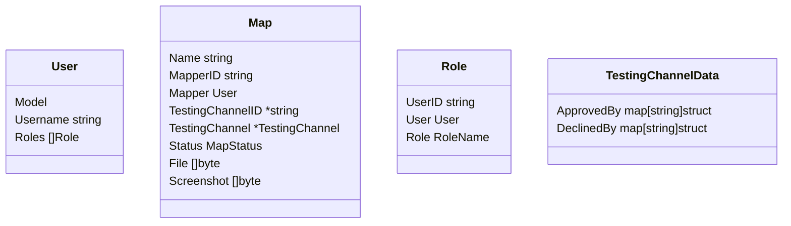

```mermaid  
classDiagram

class User {
	Model
	Username string
	Roles []Role
}

class Map {
	Name string
	MapperID string
	Mapper User
	TestingChannelID *string
	TestingChannel *TestingChannel
	Status MapStatus
	File []byte
	Screenshot []byte
}

class Role {
	UserID string
	User User
	Role RoleName
}

class TestingChannelData {
	ApprovedBy map[string]struct
	DeclinedBy map[string]struct
}


```

